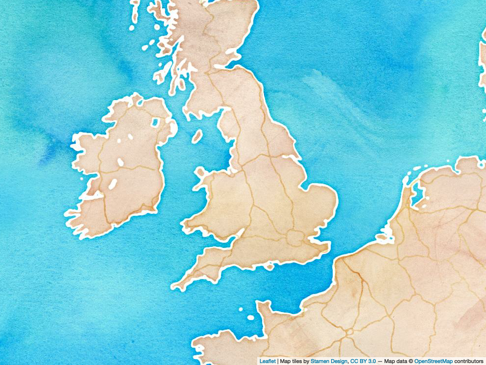
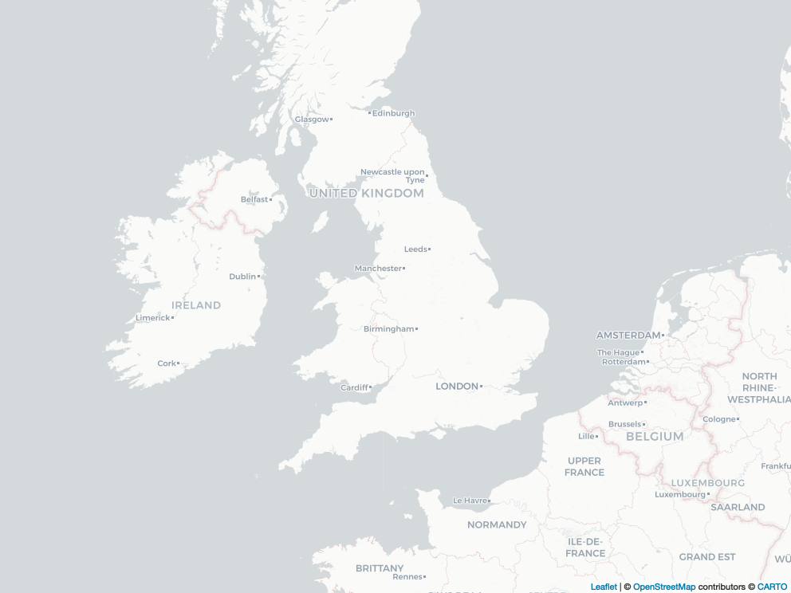
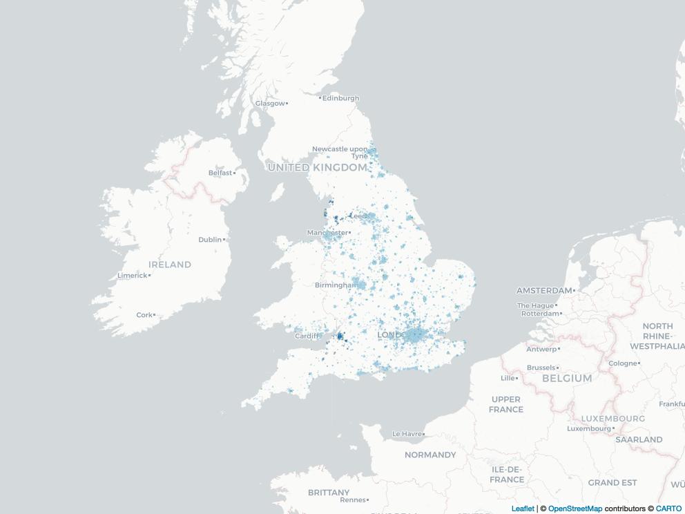
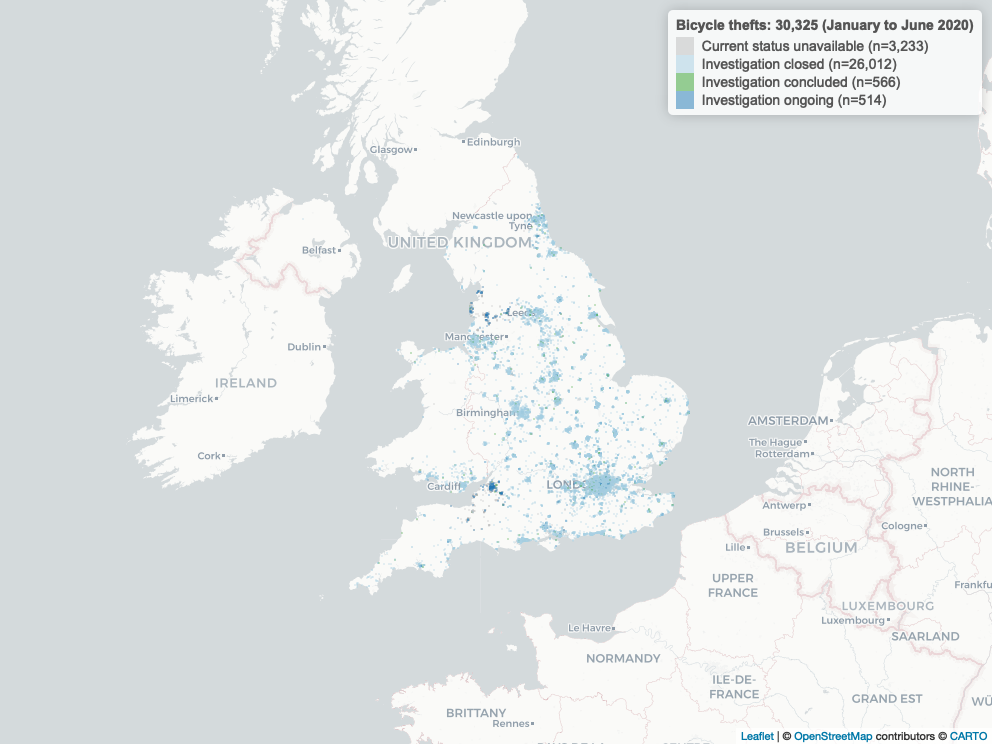
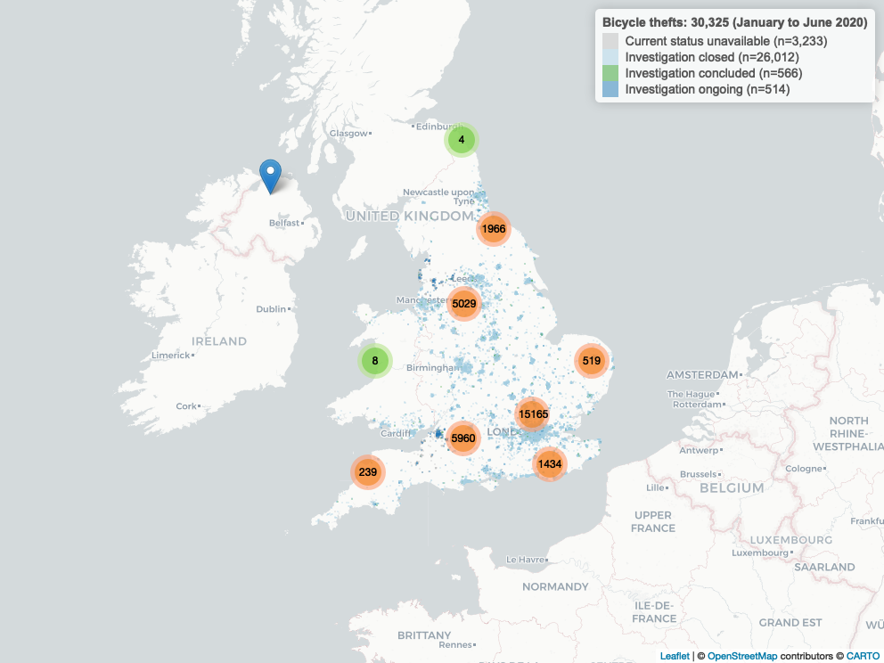

```{r setup, include=FALSE}
knitr::opts_chunk$set(echo = TRUE)
```


```{r echo=FALSE, message=FALSE}
library(english)
library(mapview)
library(readr)
library(plyr)
library(dplyr)
library(leaflet)
library(RColorBrewer)
library(tidyr)
```


# Introduction

The aim of this tutorial[^1] is to demonstrate how easy it is to create interactive maps in [R](https://www.r-project.org) using the [Leaflet](https://leafletjs.com) JavaScript framework The link between [R](https://www.r-project.org) and [Leaflet](https://leafletjs.com) is provided by [Leaflet for R](https://rstudio.github.io/leaflet/).

[^1]: This tutorial was created with [RStudio](http://rstudio.github.io) with the following libraries loaded: `r (.packages())`.


# Data

Police forces in the UK make available a wide variety of policing-related data.

Data for England, Wales, and Northern Ireland is published at [data.police.uk](https://data.police.uk) under an [Open Government Licence v3.0](https://www.nationalarchives.gov.uk/doc/open-government-licence/version/3/).

The available data on [data.police.uk](https://data.police.uk) is separated by year and police force. The first step is to download data files for 2020 for a number of police forces across England and Wales and to store them in a directory (`_assets/Mapping-Bicycle-Thefts/_data/`) where **R** can find them.

Because all of these files end with "-street.csv", the `Sys.glob()` function can be used to locate **all** files matching this pattern and store the result in the variable `data_files`. (The `*` placeholder means "any combination of letters".)

```{r}
data_files <- Sys.glob(
  "data/uk_police/*/*-street.csv")
```


## Combine data files

Each file contains data we want to combine into a single data file. We do that using the `ldply()` function from the `tidyverse()` package. The result is an **R** [data frame](https://cran.r-project.org/doc/manuals/r-release/R-intro.html#Data-frames) stored in the variable `data`. (A *data frame* is similar to a *matrix* with rows and columns.)

```{r message=FALSE}
data <- ldply(
  data_files,
  read_csv)
```

Once every data file is read and combined, the resulting *data frame* (called `data`) contains a total of `r format(as.integer(count(data)), big.mark=',')` records (or `Rows`).

The `glimpse()` function allows us to quickly, well, *glimpse* into the *data frame*.

```{r echo=FALSE}
glimpse(data)
```


## Data cleaning

Our *data frame* consists of `r as.english(length(data))` columns:

```{r}
colnames(data)
```


### Select columns

It may seem inefficient to first read all data into a single data-frame, only to remove several columns. While this isn't the most efficient way of working with a large number of data files, it is my preferred way to explore a dataset and to decide which columns to keep.

For this exercise, we keep five columns:

1. Month
2. Longitude
3. Latitude
4. Crime type
5. Last outcome category

The columns to keep from the original data frame are stored in the `columns` variable and the new labels for those columns are stored in the `column_names` variable.

```{r}
columns <- c('Month', 'Longitude', 'Latitude', 'Crime type', 'Last outcome category')
column_names <- c('DATE', 'LNG', 'LAT', 'CRIME', 'OUTCOME')

data <- data %>%
  select(all_of(columns))

colnames(data) <- column_names
```


### Outcome status

The `Last outcome category` stores one of the standard `outcome` categories used by the Police. It is the most recent known outcome for an incident at the time the data was downloaded from [data.police.uk](https://data.police.uk/).

An important manual step is to classify the standard outcome labels used by the Police.

For this exercise, we collate them into four categories:

1. **Investigation closed** incidents are no longer pursued but remain unresolved
2. **Investigation concluded** incidents resulted in some sort of resolution
3. **Investigation ongoing** describes incidents still under investigation
4. **Current status unavailable** describes incidents where no results are available

Here, these categories are referred to as `status` and will be used to format the legend of the graph, as well as the colour scheme used to highlight individual incidents on the map later on.

```{r}
# Example:
# The status "Investigation complete; no suspect identified" is used by the Police
# and is merged here into the variable "STATUS_CLOSED". (Together with others, such
# as "Unable to prosecute suspect" for example.)

STATUS_CLOSED <- c(
  "Investigation complete; no suspect identified",
  "Unable to prosecute suspect",
  "Formal action is not in the public interest",
  "Further action is not in the public interest",
  "Further investigation is not in the public interest"
  )
STATUS_CONCLUDED <- c(
  "Action to be taken by another organisation",
  "Awaiting court outcome",
  "Local resolution",
  "Offender given a caution",
  "Offender given a drugs possession warning",
  "Offender given community sentence",
  "Offender given penalty notice",
  "Suspect charged as part of another case"
  )
STATUS_ONGOING <- c(
  "Under investigation"
  )
STATUS_UNCLEAR <- c(
  "Court result unavailable",
  "Status update unavailable"
  )

data$STATUS <- NA

assign_outcome_status <- function(x) {
  if (is.na(x)) {
    return('Current status unavailable')
  } else if (x %in% STATUS_CLOSED) {
    return('Investigation closed')
  } else if (x %in% STATUS_CONCLUDED) {
    return('Investigation concluded')
  } else if (x %in% STATUS_ONGOING) {
    return('Investigation ongoing')
  } else {
    return('Current status unavailable')
  }
  }

data$STATUS <- unlist(
  lapply(
    data$OUTCOME,
    FUN = assign_outcome_status
    )
  )
```


### Dates

The year and month each incident took place is recorded and stored in the `Date` variable (or `DATE` as we have renamed it in our dataset). It may be useful to further separate `DATE` into `YEAR` and `MONTH` by creating two more columns.

```{r}
data <- data %>%
  separate(DATE, c('YEAR', 'MONTH'), '-')

data$YEAR <- as.integer(data$YEAR)
data$MONTH <- as.integer(data$MONTH)
```


# Preparation

A couple of additional preparatory steps are required before we can generate our map.


## Remove data

First, we exclude incidents in the dataset that do not contain either `Latitude` or `Longitude` coordinates.

```{r}
data <- filter(
    data,
    is.na(LNG) == FALSE,
    is.na(LAT) == FALSE,
    )
```


## Filter data

Second, the `crime` variable in the dataset includes a total of `r as.english(length(unique(data$CRIME)))` unique categories, ranging from "Anti-social behaviour" and "Bicycle theft" to "Robbery" and other serious crimes.

For this exercise, we want to visualise a single category and also limit the time-frame from which we collect incidents.

```{r}
WHICH_YEAR <- 2020
WHICH_MONTH_FROM <- 1
WHICH_MONTH_TO <- 6
WHICH_CRIME <- 'Bicycle theft'
```

We are interested in `r WHICH_CRIME` across England and Wales. To limit the number of instances in our interactive map to a more manageable size, we chose only incidents between `r month.name[WHICH_MONTH_FROM]` and `r month.name[WHICH_MONTH_TO]` `r WHICH_YEAR`.

We can quickly confirm this by looking at the first few entries (using the `head()` function) of our dataset showing only records matching the `r WHICH_CRIME` crime category.

```{r eval=FALSE, include=FALSE}
head(data[data$CRIME == WHICH_CRIME,])
```

The separation of `DATE` into `YEAR` and `MONTH` (see above) helps us limit the time-frame of incidents we want to map.

```{r}
map_data <- filter(
    data,
    YEAR == WHICH_YEAR & MONTH >= WHICH_MONTH_FROM & MONTH <= WHICH_MONTH_TO,
    CRIME == WHICH_CRIME
    )
```

The `filter` operation has reduced the number of incidents considerably; down from `r format(as.integer(count(data)), big.mark=',')` to `r format(as.integer(count(map_data)), big.mark=',')`.

```{r echo=FALSE}
glimpse(map_data)
```


# Data map

Now we have all the data we need to create our map.


## Basemap

We begin with a `basemap` that defines the boundaries of the visible area. For this, we use the *minumum* and *maximum* coordinates in our dataset.

```{r}
basemap <- leaflet(map_data) %>%
  fitBounds(
    min(map_data$LNG),
    min(map_data$LAT),
    max(map_data$LNG),
    max(map_data$LAT))  
```

Before we map our data, we have to decide on how our map should look like. For this, [Leaflet](http://leafletjs.com) provides a wide variety of [Tiles](http://leaflet-extras.github.io/leaflet-providers/preview/index.html) that can be added to the `basemap`.

A fun example are Stamen's watercolour tiles:

```{r}
watercolour_map <- basemap %>%
  addProviderTiles(
    providers$Stamen.Watercolor)  
```


```{r include=FALSE}
mapshot(
  watercolour_map,
  file = 'export/img/watercolour_map.png',
  selfcontained = FALSE)
```

{width=100%}

Although these look beautiful, they lack some detail we are interested in for this example. A possibly more appropriate version is the default *Tile* format:

```{r}
basemap <- leaflet(map_data) %>%
  addProviderTiles(
    providers$CartoDB.Positron) %>%
  fitBounds(
    min(map_data$LNG),
    min(map_data$LAT),
    max(map_data$LNG),
    max(map_data$LAT))  
```


```{r include=FALSE}
mapshot(
  basemap,
  file = 'export/img/basemap.png',
  selfcontained = FALSE)
```

{width=100%}


## Labels & colours

The next step is to create *labels* and to specify a *colour palette* for the different outcomes (which we stored earlier in the `STATUS` column).

The following two code snippets (a) add a count in the form of `(n=??)` and (b) assign a unique colour to each outcome category.

```{r}
format_labels <- function(n) {
  return(
    paste(
      n,
      ' (n=',
      format(
        as.integer(LABELS[n]),
        big.mark=','),
      ')',
      sep = ''
      )
  )  
}

LABELS <- sort(table(map_data$STATUS))
LABELS <- lapply(names(LABELS), format_labels)
```


```{r}
# based on the ColorBrewer 'PRGn' palette.
map_palette <- c(
  '#bdbdbd', # grey
  '#a6cee3', # light blue
  '#33a02c', # green
  '#1f78b4'  # blue
)

map_palette <- map_palette[1:length(LABELS)]

set_colour <- colorFactor(
  map_palette,
  domain = NULL
  )
```


## Markers

**Leaflet** also allows to customise the *markers* used to indicate where an item has been placed on the map, or rather where an incident took place. We use circles with an opacity level of 35% to ensure that areas with a large number of incidents are shown in more intense colours (because these are overlapping, thus decreasing opacity).

```{r}
map <- basemap %>%
  addCircleMarkers(
    ~LNG,
    ~LAT,
    stroke = FALSE,
    fillOpacity = .35,
    color = ~set_colour(
      STATUS),    
    radius = ~ifelse(
      STATUS %in% c(
        'Investigation concluded',
        'Awaiting court outcome',
        'Investigation ongoing'
      ), 6, 2)
  )
```


```{r include=FALSE}
printed_map <- basemap %>%
  addCircleMarkers(
    ~LNG,
    ~LAT,
    stroke = FALSE,
    fillOpacity = .35,
    color = ~set_colour(
      STATUS),    
    radius = ~ifelse(
      STATUS %in% c(
        'Investigation concluded',
        'Awaiting court outcome',
        'Investigation ongoing'
      ), 1, 1)
  )
```


```{r include=FALSE}
mapshot(
  printed_map,
  file = 'export/img/printed_map.png',
  selfcontained = FALSE)
```

{width=100%}


## Legend

We can now print the legend of different outcomes that we prepared earlier. The legend we use for this example essentially shows a `status` summary of investigations.

```{r}
map <- map %>%
  addLegend(
    'topright',
    colors = map_palette,
    labels = sort(unlist(LABELS)),
    title = paste(
      unique(map_data$CRIME),
      's: ',
      format(count(map_data), big.mark=','),
      ' (', month.name[min(map_data$MONTH)],
      ' to ', month.name[max(map_data$MONTH)],
      ' ', min(map_data$YEAR),
      ')',
      sep = ''
      )
    )
```


```{r include=FALSE}
printed_map <- printed_map %>%
  addLegend(
    'topright',
    colors = map_palette,
    labels = sort(unlist(LABELS)),
    title = paste(
      unique(map_data$CRIME),
      's: ',
      format(count(map_data), big.mark=','),
      ' (', month.name[min(map_data$MONTH)],
      ' to ', month.name[max(map_data$MONTH)],
      ' ', min(map_data$YEAR),
      ')',
      sep = ''
      )
    )
```


```{r include=FALSE}
mapshot(
  printed_map,
  file = 'export/img/printed_map-with-legend.png',
  selfcontained = FALSE)
```

{width=100%}


## Cluster

Although we have already added marker for each reported incident onto the map, it may be beneficial to add this information twice, once as individual circles and once again as part of a cluster.

This is potentially misleading as each incident appears twice on the map. But it has its advantages as it is now much easier to see a more nuanced view of incident clusters: Once as actual cluster (represented by the large circles showing the number of incidents each of them represents) and once again distributed across the map (represented by small circles, some of them overlapping).

```{r}
cluster_map <- map %>%
  addMarkers(
    ~LNG,
    ~LAT,
    popup = paste(
      '<h3 style="color:', set_colour(map_data$STATUS),
      ';text-align:center;">', toupper(map_data$STATUS),'</h3>',
      '<hr /><strong>Crime:</strong>', map_data$CRIME, '<br />',
      '<strong>Status:</strong>', map_data$OUTCOME, '<br /><hr />',
      '<p style="text-align:right;"><i>', month.name[map_data$MONTH], map_data$YEAR, '</i></p>'
      ),
    clusterOptions = markerClusterOptions()
)
```


```{r include=FALSE}
printed_cluster_map <- printed_map %>%
  addMarkers(
    ~LNG,
    ~LAT,
    clusterOptions = markerClusterOptions()
)
```


```{r include=FALSE}
mapshot(
  printed_cluster_map,
  file = 'export/img/printed_cluster-map.png',
  selfcontained = FALSE)
```

{width=100%}


# Interactive version

```{r echo=FALSE}
cluster_map
```

*(The interactive version of this map is not viewable on GitHub; knit directly into into HTML.)*


# Acknowledgements

Interactive data maps produced with [Leaflet for R](https://rstudio.github.io/leaflet/). Data from [data.police.uk](https://data.police.uk) published under the [Open Government Licence v3.0](https://www.nationalarchives.gov.uk/doc/open-government-licence/version/3/).


# Similar / related projects

1. **Andrew Ba Tran**'s (2018) "[Interactive Maps with Leaflet](https://learn.r-journalism.com/en/mapping/leaflet_maps/leaflet/)" is a short and very accessible tutorial. It is part of a chapter on "[Spatial analysis](https://learn.r-journalism.com/en/mapping/)."
2. [Chapter 3](https://cengel.github.io/R-spatial/mapping.html#web-mapping-with-leaflet) of **Claudia Engel**'s (2019) book "[Using Spatial Data with R](https://cengel.github.io/R-spatial/)" shows a number of ways of how to [make maps in R](https://cengel.github.io/R-spatial/mapping.html#web-mapping-with-leaflet).
3. **Carson Farmer & Leah Wasser**'s (2019) "[Creating Interactive Spatial Maps in R Using Leaflet](https://www.earthdatascience.org/courses/earth-analytics/get-data-using-apis/leaflet-r/)" tutorial demonstrates alternative ways of formatting markers on interactive spatial maps.
4. **Kasia Kulma**'s (2018) "[Exploring London Crime with R heat maps](https://r-tastic.co.uk/post/exploring-london-crime-with-r-heat-maps/)" reads data via the [data.police.uk API](https://data.police.uk/docs/) and combines it with scraped data from [Wikipedia](https://www.wikipedia.org/) to create a variety of [heat maps](https://en.wikipedia.org/wiki/Heat_map), including geographic heat maps for London.
5. The **tmap** package to create "[thematic maps in R](https://github.com/mtennekes/tmap)" [@Tennekes:2018aa].
6. [Andy Woodruff, Ryan Mullins, and Cristen Jones](https://maptimeboston.github.io/leaflet-intro/) [Leaflet](http://leafletjs.com/) tutorial for [Maptime Boston](http://maptimeboston.github.io/).


# Other notable projects

1. **Conlen, Matthew, John Keefe, Lauren Leatherby and Charlie Smart** (2020) "[How Full Are Hospital I.C.U.s Near You?](https://www.nytimes.com/interactive/2020/us/covid-hospitals-near-you.html), *The New York Times*, Dec. 15, 2020 [accessed Dec. 16, 2020.]


# References
