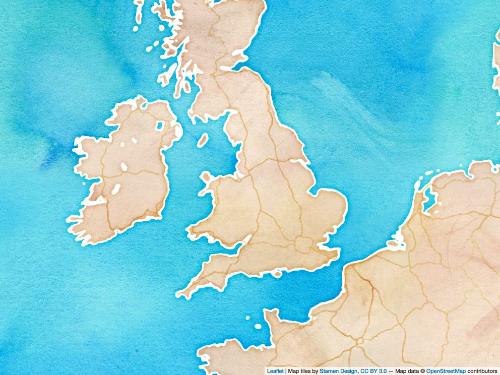
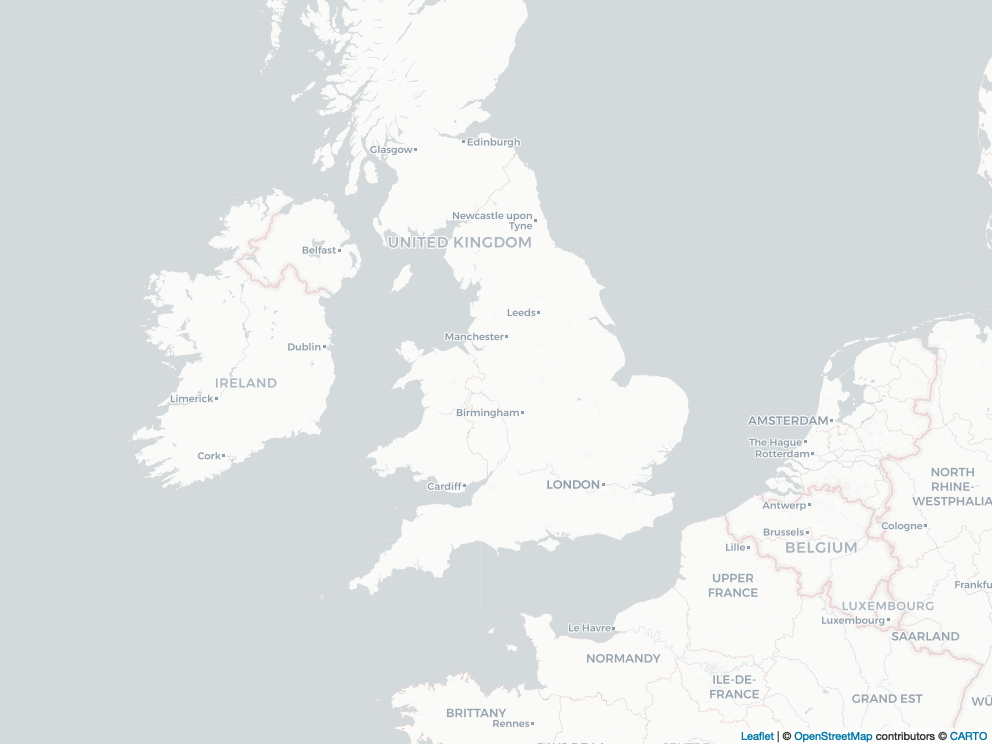
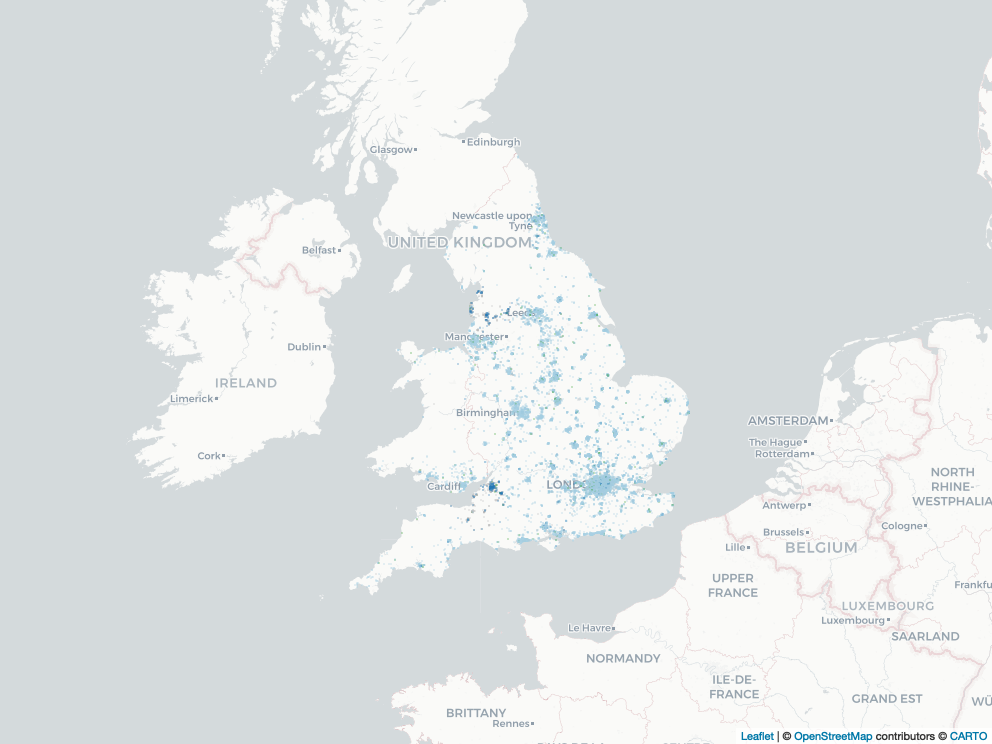
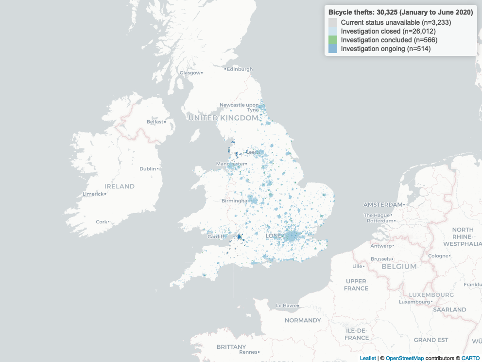
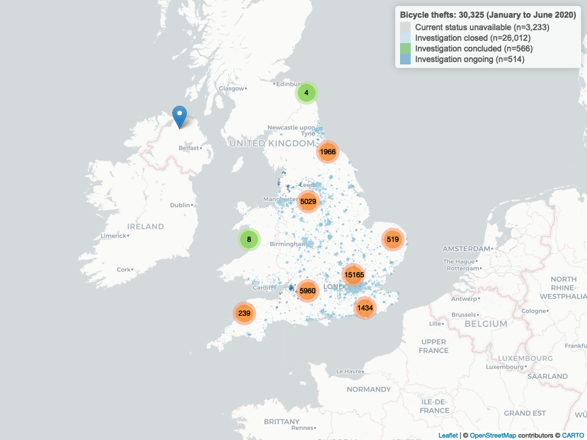

Mapping bicycle thefts across England and Wales in R
================
Alex Reppel
15 February, 2021

# Introduction

The aim of this tutorial[^1] is to demonstrate how easy it is to create
interactive maps in [R](https://www.r-project.org) using the
[Leaflet](https://leafletjs.com) JavaScript framework The link between
[R](https://www.r-project.org) and [Leaflet](https://leafletjs.com) is
provided by [Leaflet for R](https://rstudio.github.io/leaflet/).

# Data

Police forces in the UK make available a wide variety of
policing-related data.

Data for England, Wales, and Northern Ireland is published at
[data.police.uk](https://data.police.uk) under an [Open Government
Licence
v3.0](https://www.nationalarchives.gov.uk/doc/open-government-licence/version/3/).

The available data on [data.police.uk](https://data.police.uk) is
separated by year and police force. The first step is to download data
files for 2020 for a number of police forces across England and Wales
and to store them in a directory (`data/`) where **R** can find them.

Because all of these files end with “-street.csv”, the `Sys.glob()`
function can be used to locate **all** files matching this pattern and
store the result in the variable `data_files`. (The `*` place holder
means “any combination of letters”.)

``` r
data_files <- Sys.glob(
  "data/*/*-street.csv")
```

## Combine data files

Each file contains data we want to combine into a single data file. We
do that using the `ldply()` function from the `tidyverse()` package. The
result is an **R** [data
frame](https://cran.r-project.org/doc/manuals/r-release/R-intro.html#Data-frames)
stored in the variable `data`. (A *data frame* is similar to a *matrix*
with rows and columns.)

``` r
data <- ldply(
  data_files,
  read_csv)
```

Once every data file is read and combined, the resulting *data frame*
(called `data`) contains a total of 5,162,703 records (or `Rows`).

The `glimpse()` function allows us to quickly, well, *glimpse* into the
*data frame*.

    ## Rows: 5,162,703
    ## Columns: 12
    ## $ `Crime ID`              <chr> NA, "be92f870c8b560fccc562407cc3537c7e0a2df76c…
    ## $ Month                   <chr> "2020-01", "2020-01", "2020-01", "2020-01", "2…
    ## $ `Reported by`           <chr> "Avon and Somerset Constabulary", "Avon and So…
    ## $ `Falls within`          <chr> "Avon and Somerset Constabulary", "Avon and So…
    ## $ Longitude               <dbl> -2.509384, -2.494870, -2.494870, -2.494870, -2…
    ## $ Latitude                <dbl> 51.40959, 51.42228, 51.42228, 51.42228, 51.422…
    ## $ Location                <chr> "On or near Barnard Walk", "On or near Confere…
    ## $ `LSOA code`             <chr> "E01014399", "E01014399", "E01014399", "E01014…
    ## $ `LSOA name`             <chr> "Bath and North East Somerset 001A", "Bath and…
    ## $ `Crime type`            <chr> "Anti-social behaviour", "Burglary", "Burglary…
    ## $ `Last outcome category` <chr> NA, "Status update unavailable", "Status updat…
    ## $ Context                 <lgl> NA, NA, NA, NA, NA, NA, NA, NA, NA, NA, NA, NA…

## Data cleaning

Our *data frame* consists of 12 columns:

``` r
colnames(data)
```

    ##  [1] "Crime ID"              "Month"                 "Reported by"          
    ##  [4] "Falls within"          "Longitude"             "Latitude"             
    ##  [7] "Location"              "LSOA code"             "LSOA name"            
    ## [10] "Crime type"            "Last outcome category" "Context"

### Select columns

It may seem inefficient to first read all data into a single data-frame,
only to remove several columns. While this isn’t the most efficient way
of working with a large number of data files, it is my preferred way to
explore a dataset and to decide which columns to keep.

For this exercise, we keep five columns:

1.  Month
2.  Longitude
3.  Latitude
4.  Crime type
5.  Last outcome category

The columns to keep from the original data frame are stored in the
`columns` variable and the new labels for those columns are stored in
the `column_names` variable.

``` r
columns <- c('Month', 'Longitude', 'Latitude', 'Crime type', 'Last outcome category')
column_names <- c('DATE', 'LNG', 'LAT', 'CRIME', 'OUTCOME')

data <- data %>%
  select(all_of(columns))

colnames(data) <- column_names
```

### Outcome status

The `Last outcome category` stores one of the standard `outcome`
categories used by the Police. It is the most recent known outcome for
an incident at the time the data was downloaded from
[data.police.uk](https://data.police.uk/).

An important manual step is to classify the standard outcome labels used
by the Police.

For this exercise, we collate them into four categories:

1.  **Investigation closed** incidents are no longer pursued but remain
    unresolved
2.  **Investigation concluded** incidents resulted in some sort of
    resolution
3.  **Investigation ongoing** describes incidents still under
    investigation
4.  **Current status unavailable** describes incidents where no results
    are available

Here, these categories are referred to as `status` and will be used to
format the legend of the graph, as well as the colour scheme used to
highlight individual incidents on the map later on.

``` r
# Example:
# The status "Investigation complete; no suspect identified" is used by the Police
# and is merged here into the variable "STATUS_CLOSED". (Together with others, such
# as "Unable to prosecute suspect" for example.)

STATUS_CLOSED <- c(
  "Investigation complete; no suspect identified",
  "Unable to prosecute suspect",
  "Formal action is not in the public interest",
  "Further action is not in the public interest",
  "Further investigation is not in the public interest"
  )
STATUS_CONCLUDED <- c(
  "Action to be taken by another organisation",
  "Awaiting court outcome",
  "Local resolution",
  "Offender given a caution",
  "Offender given a drugs possession warning",
  "Offender given community sentence",
  "Offender given penalty notice",
  "Suspect charged as part of another case"
  )
STATUS_ONGOING <- c(
  "Under investigation"
  )
STATUS_UNCLEAR <- c(
  "Court result unavailable",
  "Status update unavailable"
  )

data$STATUS <- NA

assign_outcome_status <- function(x) {
  if (is.na(x)) {
    return('Current status unavailable')
  } else if (x %in% STATUS_CLOSED) {
    return('Investigation closed')
  } else if (x %in% STATUS_CONCLUDED) {
    return('Investigation concluded')
  } else if (x %in% STATUS_ONGOING) {
    return('Investigation ongoing')
  } else {
    return('Current status unavailable')
  }
  }

data$STATUS <- unlist(
  lapply(
    data$OUTCOME,
    FUN = assign_outcome_status
    )
  )
```

### Dates

The year and month each incident took place is recorded and stored in
the `Date` variable (or `DATE` as we have renamed it in our dataset). It
may be useful to further separate `DATE` into `YEAR` and `MONTH` by
creating two more columns.

``` r
data <- data %>%
  separate(DATE, c('YEAR', 'MONTH'), '-')

data$YEAR <- as.integer(data$YEAR)
data$MONTH <- as.integer(data$MONTH)
```

# Preparation

A couple of additional preparatory steps are required before we can
generate our map.

## Remove data

First, we exclude incidents in the dataset that do not contain either
`Latitude` or `Longitude` coordinates.

``` r
data <- filter(
    data,
    is.na(LNG) == FALSE,
    is.na(LAT) == FALSE,
    )
```

## Filter data

Second, the `crime` variable in the dataset includes a total of 14
unique categories, ranging from “Anti-social behaviour” and “Bicycle
theft” to “Robbery” and other serious crimes.

For this exercise, we want to visualise a single category and also limit
the time-frame from which we collect incidents.

``` r
WHICH_YEAR <- 2020
WHICH_MONTH_FROM <- 1
WHICH_MONTH_TO <- 6
WHICH_CRIME <- 'Bicycle theft'
```

We are interested in Bicycle theft across England and Wales. To limit
the number of instances in our interactive map to a more manageable
size, we chose only incidents between January and June 2020.

We can quickly confirm this by looking at the first few entries (using
the `head()` function) of our dataset showing only records matching the
Bicycle theft crime category.

The separation of `DATE` into `YEAR` and `MONTH` (see above) helps us
limit the time-frame of incidents we want to map.

``` r
map_data <- filter(
    data,
    YEAR == WHICH_YEAR & MONTH >= WHICH_MONTH_FROM & MONTH <= WHICH_MONTH_TO,
    CRIME == WHICH_CRIME
    )
```

The `filter` operation has reduced the number of incidents considerably;
down from 5,071,884 to 30,325.

    ## Rows: 30,325
    ## Columns: 7
    ## $ YEAR    <int> 2020, 2020, 2020, 2020, 2020, 2020, 2020, 2020, 2020, 2020, 20…
    ## $ MONTH   <int> 1, 1, 1, 1, 1, 1, 1, 1, 1, 1, 1, 1, 1, 1, 1, 1, 1, 1, 1, 1, 1,…
    ## $ LNG     <dbl> -2.502878, -2.391092, -2.358051, -2.362118, -2.368555, -2.3258…
    ## $ LAT     <dbl> 51.40628, 51.39719, 51.37753, 51.38486, 51.38119, 51.35826, 51…
    ## $ CRIME   <chr> "Bicycle theft", "Bicycle theft", "Bicycle theft", "Bicycle th…
    ## $ OUTCOME <chr> "Status update unavailable", "Status update unavailable", "Sta…
    ## $ STATUS  <chr> "Current status unavailable", "Current status unavailable", "C…

# Data map

Now we have all the data we need to create our map.

## Basemap

We begin with a `basemap` that defines the boundaries of the visible
area. For this, we use the *minumum* and *maximum* coordinates in our
dataset.

``` r
basemap <- leaflet(map_data) %>%
  fitBounds(
    min(map_data$LNG),
    min(map_data$LAT),
    max(map_data$LNG),
    max(map_data$LAT))  
```

Before we map our data, we have to decide on how our map should look
like. For this, [Leaflet](http://leafletjs.com) provides a wide variety
of
[Tiles](http://leaflet-extras.github.io/leaflet-providers/preview/index.html)
that can be added to the `basemap`.

A fun example are Stamen’s watercolour tiles:

``` r
watercolour_map <- basemap %>%
  addProviderTiles(
    providers$Stamen.Watercolor)  
```

<figure>

<figcaption aria-hidden="true">Basemap with Stamen watercolour
design.</figcaption>
</figure>

Although these look beautiful, they lack some detail we are interested
in for this example. A possibly more appropriate version is the default
*Tile* format:

``` r
basemap <- leaflet(map_data) %>%
  addProviderTiles(
    providers$CartoDB.Positron) %>%
  fitBounds(
    min(map_data$LNG),
    min(map_data$LAT),
    max(map_data$LNG),
    max(map_data$LAT))  
```

<figure>

<figcaption aria-hidden="true">Basemap with default OpenStretMap
design.</figcaption>
</figure>

## Labels & colours

The next step is to create *labels* and to specify a *colour palette*
for the different outcomes (which we stored earlier in the `STATUS`
column).

The following two code snippets (a) add a count in the form of `(n=??)`
and (b) assign a unique colour to each outcome category.

``` r
format_labels <- function(n) {
  return(
    paste(
      n,
      ' (n=',
      format(
        as.integer(LABELS[n]),
        big.mark=','),
      ')',
      sep = ''
      )
  )  
}

LABELS <- sort(table(map_data$STATUS))
LABELS <- lapply(names(LABELS), format_labels)
```

``` r
# based on the ColorBrewer 'PRGn' palette.
map_palette <- c(
  '#bdbdbd', # grey
  '#a6cee3', # light blue
  '#33a02c', # green
  '#1f78b4'  # blue
)

map_palette <- map_palette[1:length(LABELS)]

set_colour <- colorFactor(
  map_palette,
  domain = NULL
  )
```

## Markers

**Leaflet** also allows to customise the *markers* used to indicate
where an item has been placed on the map, or rather where an incident
took place. We use circles with an opacity level of 35% to ensure that
areas with a large number of incidents are shown in more intense colours
(because these are overlapping, thus decreasing opacity).

``` r
map <- basemap %>%
  addCircleMarkers(
    ~LNG,
    ~LAT,
    stroke = FALSE,
    fillOpacity = .35,
    color = ~set_colour(
      STATUS),    
    radius = ~ifelse(
      STATUS %in% c(
        'Investigation concluded',
        'Awaiting court outcome',
        'Investigation ongoing'
      ), 6, 2)
  )
```

<figure>

<figcaption aria-hidden="true">Map with markers indicating individual
incidents.</figcaption>
</figure>

## Legend

We can now print the legend of different outcomes that we prepared
earlier. The legend we use for this example essentially shows a `status`
summary of investigations.

``` r
map <- map %>%
  addLegend(
    'topright',
    colors = map_palette,
    labels = sort(unlist(LABELS)),
    title = paste(
      unique(map_data$CRIME),
      's: ',
      format(count(map_data), big.mark=','),
      ' (', month.name[min(map_data$MONTH)],
      ' to ', month.name[max(map_data$MONTH)],
      ' ', min(map_data$YEAR),
      ')',
      sep = ''
      )
    )
```

<figure>

<figcaption aria-hidden="true">Map with markers indicating individual
incidents (with legend).</figcaption>
</figure>

## Cluster

Although we have already added marker for each reported incident onto
the map, it may be beneficial to add this information twice, once as
individual circles and once again as part of a cluster.

This is potentially misleading as each incident appears twice on the
map. But it has its advantages as it is now much easier to see a more
nuanced view of incident clusters: Once as actual cluster (represented
by the large circles showing the number of incidents each of them
represents) and once again distributed across the map (represented by
small circles, some of them overlapping).

``` r
cluster_map <- map %>%
  addMarkers(
    ~LNG,
    ~LAT,
    popup = paste(
      '<h3 style="color:', set_colour(map_data$STATUS),
      ';text-align:center;">', toupper(map_data$STATUS),'</h3>',
      '<hr /><strong>Crime:</strong>', map_data$CRIME, '<br />',
      '<strong>Status:</strong>', map_data$OUTCOME, '<br /><hr />',
      '<p style="text-align:right;"><i>', month.name[map_data$MONTH], map_data$YEAR, '</i></p>'
      ),
    clusterOptions = markerClusterOptions()
)
```

<figure>

<figcaption aria-hidden="true">Cluster map with markers indicating
individual incidents.</figcaption>
</figure>

# Interactive version

<!-- -->

*(The interactive version of this map is not viewable on GitHub; knit
the .Rmd script directly to HTML.)*

# Acknowledgements

Interactive data maps produced with [Leaflet for
R](https://rstudio.github.io/leaflet/). Data from
[data.police.uk](https://data.police.uk) published under the [Open
Government Licence
v3.0](https://www.nationalarchives.gov.uk/doc/open-government-licence/version/3/).

# Similar / related projects

1.  **Andrew Ba Tran**’s (2018) “[Interactive Maps with
    Leaflet](https://learn.r-journalism.com/en/mapping/leaflet_maps/leaflet/)”
    is a short and very accessible tutorial. It is part of a chapter on
    “[Spatial analysis](https://learn.r-journalism.com/en/mapping/).”
2.  [Chapter
    3](https://cengel.github.io/R-spatial/mapping.html#web-mapping-with-leaflet)
    of **Claudia Engel**’s (2019) book “[Using Spatial Data with
    R](https://cengel.github.io/R-spatial/)” shows a number of ways of
    how to [make maps in
    R](https://cengel.github.io/R-spatial/mapping.html#web-mapping-with-leaflet).
3.  **Carson Farmer & Leah Wasser**’s (2019) “[Creating Interactive
    Spatial Maps in R Using
    Leaflet](https://www.earthdatascience.org/courses/earth-analytics/get-data-using-apis/leaflet-r/)”
    tutorial demonstrates alternative ways of formatting markers on
    interactive spatial maps.
4.  **Kasia Kulma**’s (2018) “[Exploring London Crime with R heat
    maps](https://r-tastic.co.uk/post/exploring-london-crime-with-r-heat-maps/)”
    reads data via the [data.police.uk
    API](https://data.police.uk/docs/) and combines it with scraped data
    from [Wikipedia](https://www.wikipedia.org/) to create a variety of
    [heat maps](https://en.wikipedia.org/wiki/Heat_map), including
    geographic heat maps for London.
5.  The **tmap** package to create “[thematic maps in
    R](https://github.com/mtennekes/tmap)” (Tennekes 2018).
6.  [Andy Woodruff, Ryan Mullins, and Cristen
    Jones](https://maptimeboston.github.io/leaflet-intro/)
    [Leaflet](http://leafletjs.com/) tutorial for [Maptime
    Boston](http://maptimeboston.github.io/).

# Other notable projects

1.  **Conlen, Matthew, John Keefe, Lauren Leatherby and Charlie
    Smart** (2020) “[How Full Are Hospital I.C.U.s Near
    You?](https://www.nytimes.com/interactive/2020/us/covid-hospitals-near-you.html),
    *The New York Times*, Dec. 15, 2020 \[accessed Dec. 16, 2020.\]

# References

<div id="refs" class="references csl-bib-body hanging-indent">

<div id="ref-Tennekes:2018aa" class="csl-entry">

Tennekes, Martijn. 2018. “Tmap: Thematic Maps in R.” *Journal of
Statistical Software, Articles* 84 (6): 1–39.
<https://doi.org/10.18637/jss.v084.i06>.

</div>

</div>

[^1]: This tutorial was created with [RStudio](http://rstudio.github.io)
    with the following libraries loaded: tidyr, RColorBrewer, leaflet,
    dplyr, plyr, readr, mapview, english, stats, graphics, grDevices,
    datasets, utils, methods, base.
